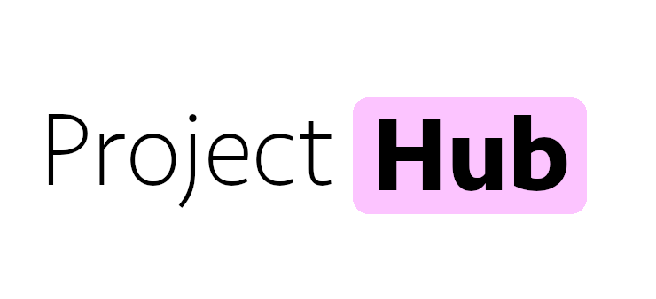

<p align="center">
  
  <br>
  A Halfway Hackathon project that allows fellows to share side projects with each other and increase collaboration!
  <br>
  <br>
  <a href="https://github.com/MLH-Fellowship/ProjectHub/pulls">
    
  </a>
</p>

# Usage

Project Site: [https://projecthub.tech](https://projecthub.tech)

## ⚒️ Requirements:

1. Brew
2. Python: 3.9 `brew install python`
3. NodeJS >= 10.x
4. NPM >= 6.x
5. PostgreSQL: `brew install postgresql`
6. Docker and Docker-compose. Check this [link](https://dockerlabs.collabnix.com/intermediate/workshop/DockerCompose/How_to_Install_Docker_Compose.html)
7. `.env` file - Plese contact the authors for the `.env`

## ✅ Getting Started

Install ProjectHub with this one-line command

```sh
$ git clone https://github.com/MLH-Fellowship/ProjectHub.git

# FRONT-END
$ cd frontend/

$ npm i

$ npm run build

$ npm run dev

# OPEN ANOTHER TERMINAL TO RUN SERVER
$ cd backend/

$ python3.9 -m venv .venv && source .venv/bin/activate

$ pip install -r requirements.txt

$ python utils/rsa.py server

$ uvicorn main:app --reload
```

# Help/Supports

-   If you want to contribute, please [file an issue here](https://github.com/MLH-Fellowship/ProjectHub/issues).
